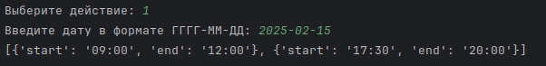
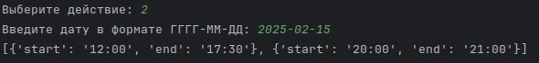
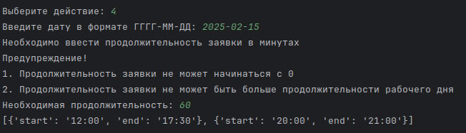
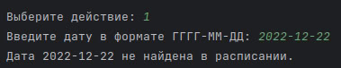

CSV - Handler
---
---

### Содержание:

- [Как использовать?](#title1);
- [Примеры позитивных кейсов](#title2);
- [Примеры негативных кейсов](#title3);
- [Доп. Утилиты](#title4).

---

## Главная функция:

> 🔶 **Получения графика занятности работника через эндпоинт и обработка данных на следующий функционал**
> 
> **1. Найти все занятые промежутки для указанной даты**
> 
> **2. Найти свободное время для заданной даты**
> 
> **3. Вывести доступен ли заданный промежуток времени для заданной даты**
> 
> **4. Найти для указанной продолжительности заявки свободное время в графике**
---

### 🔹<a id="title1">Как использовать?</a>:🧩

Запуск:
```bash
python main.py
```

### 🔹<a id="title2">Примеры позитивных кейсов</a>:

> Найти все занятые промежутки для указанной даты:



> Найти свободное время для заданной даты:



> Доступен ли указанный промежуток времени для заданной даты:


> Найти для указанной продолжительности заявки свободное время в графике:



---

### 🔹<a id="title3">Примеры негативных кейсов</a>:

Основные негативные кейсы:

> Некорректный ввод даты


> Даты в расписании не обнаружено



---

### 🔹<a id="title4">Доп. Утилиты</a>:💡

#### Линтер:

```bash
flake8 ./
```

---

#### Типизатор:

```bash
mypy ./
```

---

#### Тесты:

```bash
pytest -v
```

---
